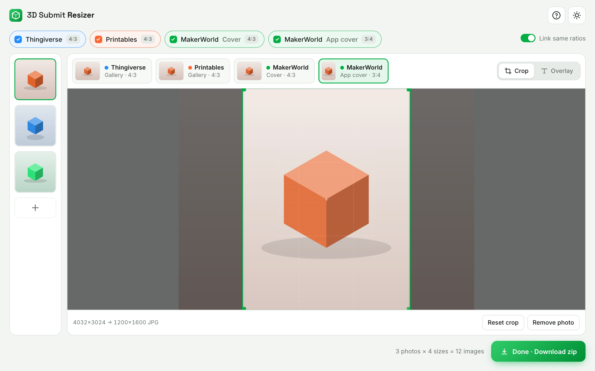

# 3D Submit Resizer

Crop and resize photos for **Thingiverse**, **Printables** and **MakerWorld** in one go. It runs entirely in the browser, so nothing gets uploaded.

**Live:** https://theanam.github.io/3dsubmit-resizer/



- Opens JPG, PNG, WebP and HEIC
- Pick which sites and variants you need; each gets an auto crop you can adjust
- Straighten tilted shots (±45°) without blank corners
- Combine 2–4 photos into a collage whose layout adapts to each size (or pick a fixed one)
- Overlay text and images (logos, badges): system fonts, style presets, outline, shadow/glow, 3D extrusion, background box
- Exports a zip of JPEGs (quality 88, max 1600px on the long edge, never upscaled)

| Output | Ratio | Max size |
|---|---|---|
| Thingiverse gallery | 4:3 | 1600×1200 |
| Printables gallery | 4:3 | 1600×1200 |
| MakerWorld cover (web) | 4:3 | 1600×1200 |
| MakerWorld app cover | 3:4 | 1200×1600 |

## Develop

It's a static site with no build step:

```sh
python3 -m http.server
```

Every push to `main` deploys to GitHub Pages through `.github/workflows/deploy.yml`.

Feature requests: [issues](https://github.com/theanam/3dsubmit-resizer/issues) · Feedback: anam.ahmed.a@gmail.com

Screenshot photos by [Snapmaker 3D Printer](https://unsplash.com/@snapmaker_official) on [Unsplash](https://unsplash.com/photos/3d-printed-star-shaped-object-with-a-cylindrical-piece-q9EhSGklJGY).
